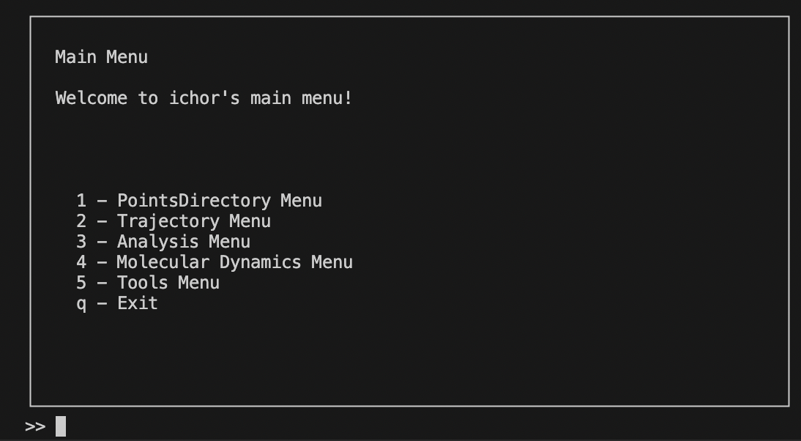

# Launching the Menu

After installing `ichor.cli`, it can be launched from the command line using `ichor-cli`. Many common tools to submit jobs are available in the command line interface (CLI). Behind the scenes, the `console-menu` package is used to make the menus.

Below is an example of what the menu structure looks like. Selecting options and pressing `Enter` leads to sub-menus with more options. The most common options are shown in the menus, not all of the functionality is available through the menus. However, one can complete all steps starting from making a dataset (using AMBER, CP2K) to running Gaussian and AIMAll, to making datasets for machine learning from the menus.

