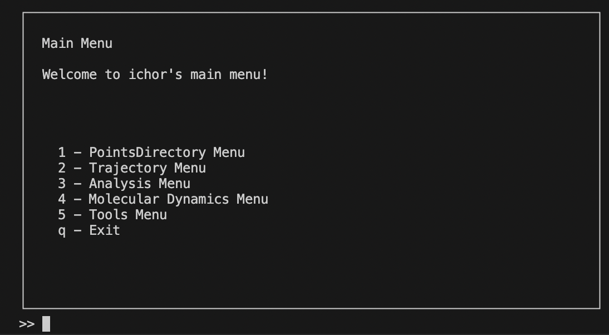

# Submitting AIMAll from the command line

Install or update `ichor-cli` to register the `ichor` command (for a source
checkout, run `pip install -e ./ichor_cli`). Submit an existing points directory:

```sh
ichor aimall run water.pointsdir --method B3LYP --ncores 4 --naat 2 --encomp 3
ichor aimall run water.pointsdir --atoms O1 H2 --force --no-iasprops
ichor aimall run --help
```

The directory defaults to the current working directory, which must be a
`.pointsdir`. Submission uses the existing HPC configuration in
`~/ichor_config.yaml` and the configured scheduler. Help does not require HPC
configuration. Defaults match the Python submission API. Boolean AIMAll settings
accept `--setting` and `--no-setting`; `--atidsprops some` selects 0.001.
Use `--hold JOB_ID` to wait for another scheduler job, and `--script-name`,
`--outputs-dir-path`, or `--errors-dir-path` to override submission paths.
The command reports the submitted job ID or that no jobs require submission.

# Submitting Gaussian from the command line

```sh
ichor gaussian run WATER.pointsdir --method B3LYP --basis-set '6-31+g(d,p)' --ncores 4
ichor gaussian run WATER.pointsdir --charge -1 --spin-multiplicity 2 --keywords opt nosymm --overwrite-existing --force
ichor gaussian run --help
```

The command creates missing GJF files from the XYZ geometries and submits them
through the configured scheduler. Existing GJF files keep their settings unless
`--overwrite-existing` is supplied. `--force` (or `--force-calculate-wfn`)
requests recalculation even when wavefunctions already exist. Unspecified input
settings use the existing GJF writer defaults. Quote basis sets containing shell
metacharacters, as shown above.

The directory defaults to the current `.pointsdir`. `--hold`, `--script-name`,
`--outputs-dir-path`, and `--errors-dir-path` work as for AIMAll. Additional input
options include `--title`, `--link0` (values without the leading `%`), and
`--output-chk`. Help works without HPC configuration.

# Submitting data generation from YAML

Check either stage with `ichor gaussian status WATER.pointsdir` or
`ichor aimall status WATER.pointsdir`. The directory defaults to the current
`.pointsdir`. Status reports completed / total, failed, running, pending, and
unknown counts. New submissions record scheduler array tasks in
`.ichor-status.json` inside the points directory. Older runs use output files;
incomplete output without a tracked task is reported as unknown. Gaussian
completion requires normal termination; AIMAll completion uses the existing
integration-file checks. Status queries the configured scheduler for tracked
submissions. The previous `submit_gaussian`, `submit_aimall`, and
`submit_datagen` commands remain supported.

Place `ichor_workflow.yaml` in your current directory, set `input.path` to your
XYZ trajectory or existing `.pointsdir`, and run on the cluster login node:

```sh
ichor datagen
ichor datagen /path/to/custom_workflow.yaml
ichor datagen --help
```

The command calls `submit_data_generation_from_yaml` and reports the points
directory and submitted job IDs. Use the stage status commands to check
progress. Submission does not wait for the workflow to finish. Relative input
paths are resolved against the
YAML file's directory. The workflow queues Gaussian, AIMAll, and the enabled
database/CSV stages with scheduler dependencies. Enabling CSVs also enables
SQLite database creation. Machine and software settings still come from
`~/ichor_config.yaml`. Help works without HPC configuration.

# Launching the Menu

After installing `ichor.cli`, it can be launched from the command line using `ichor-cli`. Many common tools to submit jobs are available in the command line interface (CLI). Behind the scenes, the `console-menu` package is used to make the menus.

Below is an example of what the menu structure looks like. Selecting options and pressing `Enter` leads to sub-menus with more options. The most common options are shown in the menus, not all of the functionality is available through the menus. However, one can complete all steps starting from making a dataset (using AMBER, CP2K) to running Gaussian and AIMAll, to making datasets for machine learning from the menus.


